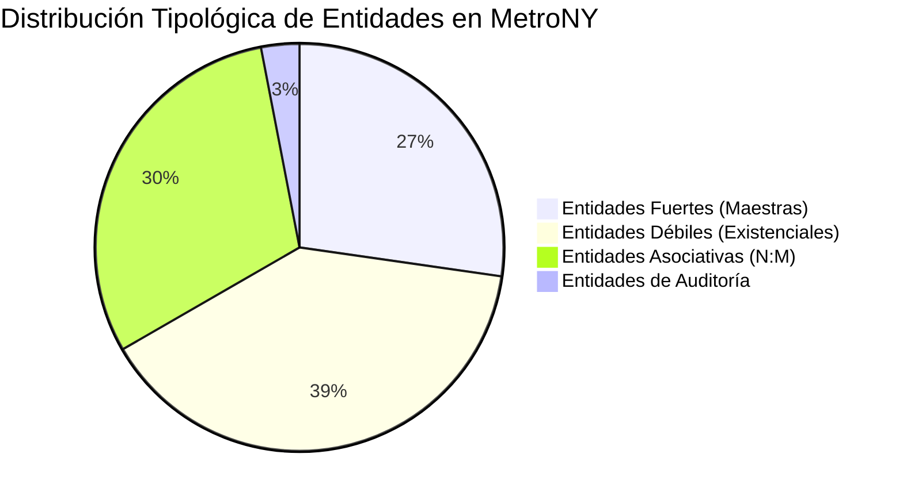
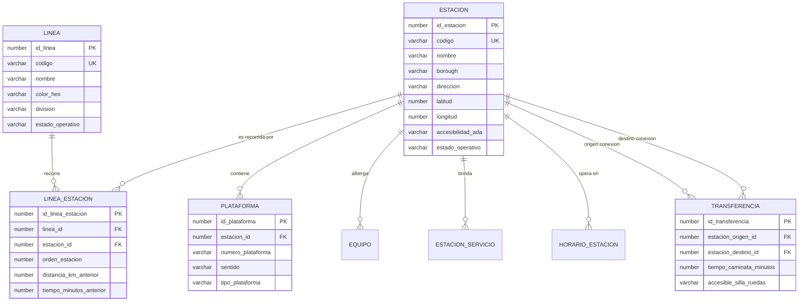
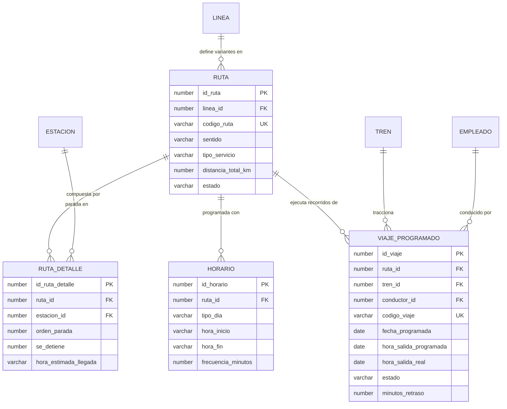
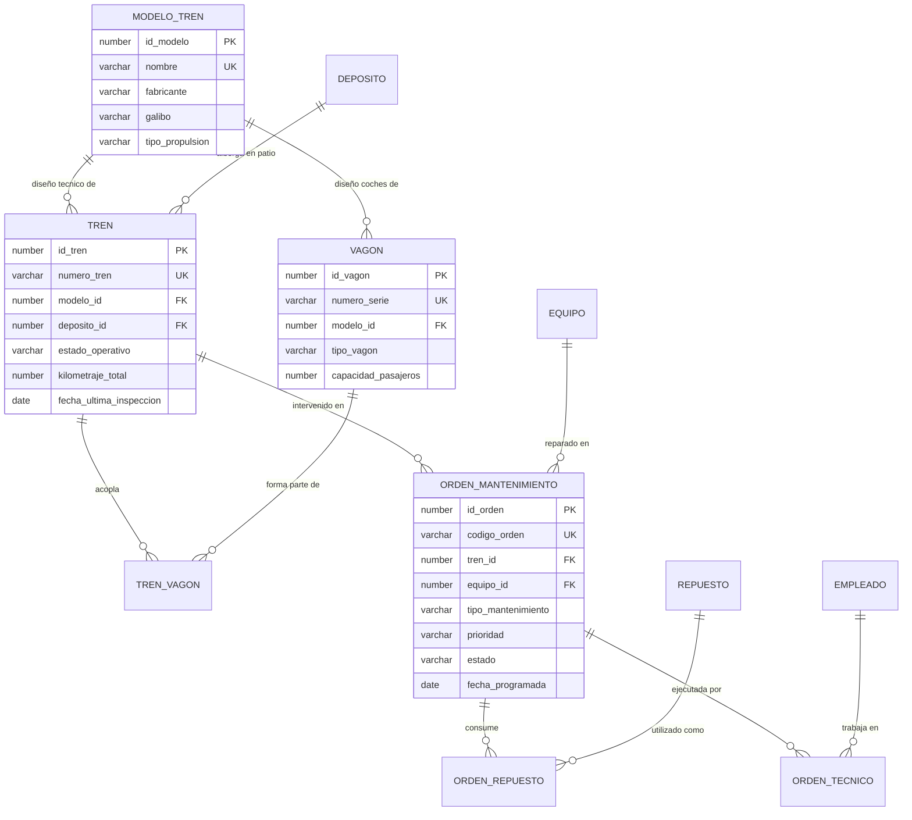
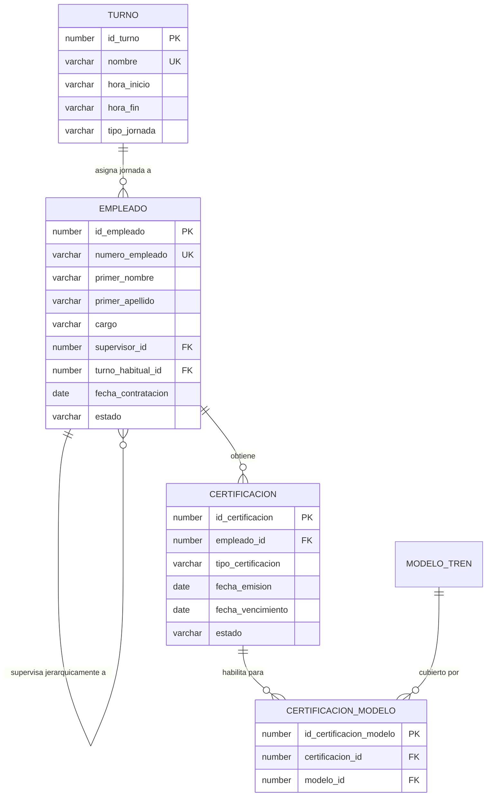
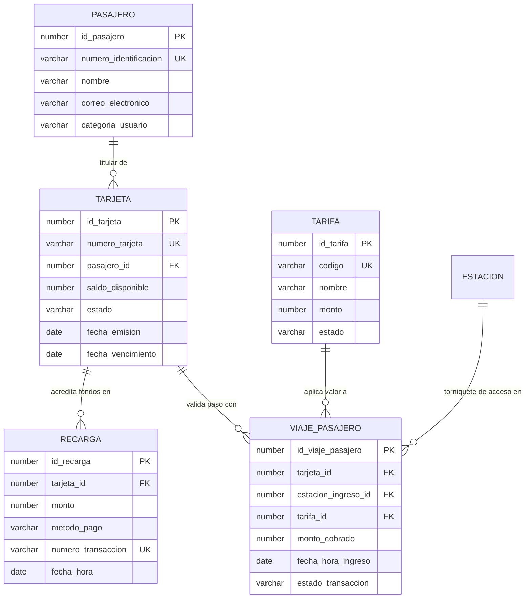
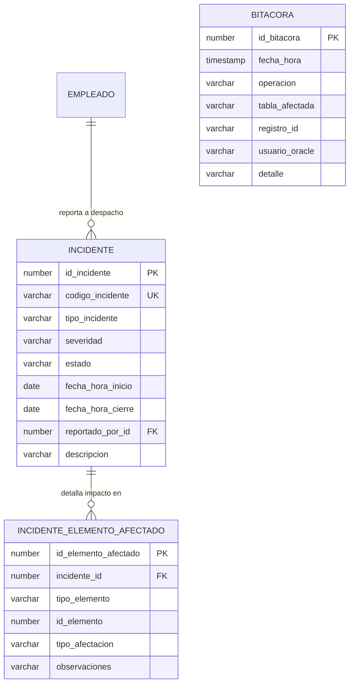

# Modelo Entidad-Relación y Transformación Relacional
## Sistema de Gestión de la Red de Metro de Nueva York (MTA NYCT)

> **Entregables Oficiales No. 2, 3 y 5**: Identificación de entidades, atributos, dominios, relaciones, cardinalidades en notación Barker CDM / Oracle Data Modeler, diagramas conceptuales por subsistemas y mapeo formal al esquema relacional de Oracle.

---

## 1. Clasificación Tipológica de Entidades

El modelo de datos del Metro de Nueva York fue concebido para administrar de manera integral tanto la infraestructura física fija (vías, estaciones, plataformas) como la flota móvil, el tráfico comercial en tiempo real, el billetaje contactless OMNY, el personal técnico y los incidentes 24/7.

Las **33 entidades** se clasifican formalmente en cuatro categorías ontológicas:

### 1.1 Entidades Fuertes (Maestras Independientes)
Poseen existencia autónoma en el dominio del negocio; no dependen de la existencia previa de otra entidad para subsistir:
1. `LINEA`: Define las arterias troncales del metro de Nueva York (A, 1, 7, L, etc.).
2. `ESTACION`: Complejos de abordaje y transferencia en los cinco distritos (boroughs).
3. `MODELO_TREN`: Especificaciones de ingeniería rodante (R142, R160, R211, etc.).
4. `DEPOSITO`: Patios y yardas maestras de maniobras y pernocte de material rodante.
5. `EMPLEADO`: Recursos humanos contratados por MTA NYCT.
6. `PASAJERO`: Usuarios registrados en el sistema de transporte metropolitano.
7. `REPUESTO`: Catálogo de inventario de piezas mecánicas y electrónicas de repuesto.
8. `TARIFA`: Parámetros regulatorios y montos oficiales del pasaje ($2.90 base, $1.45 reducida).
9. `TURNO`: Horarios reglamentarios de jornada laboral del personal operativo.

### 1.2 Entidades Débiles (Dependientes por Existencia)
Su existencia está condicionada a la ocurrencia de una entidad padre:
1. `PLATAFORMA`: Depende existencialmente de una `ESTACION` (`ON DELETE CASCADE`).
2. `EQUIPO`: Maquinaria electromecánica (elevadores, escaleras, torniquetes) ligada a una `ESTACION`.
3. `VAGON`: Coche individual dependiente de las especificaciones de su fabricante.
4. `TREN`: Convoy operativo acoplado dependiente de su `MODELO_TREN` y asignado a un `DEPOSITO`.
5. `RUTA`: Recorrido comercial dependiente de una `LINEA` de metro.
6. `HORARIO`: Ventana de servicio asociada a una `RUTA`.
7. `VIAJE_PROGRAMADO`: Despacho de circulación dependiente de una `RUTA` y un `TREN`.
8. `TARJETA`: Medio de pago OMNY emitido a nombre de un `PASAJERO`.
9. `RECARGA`: Transacción de abono dependiente de una `TARJETA`.
10. `VIAJE_PASAJERO`: Registro de acceso por torniquete dependiente de una `TARJETA` y una `TARIFA`.
11. `INCIDENTE`: Evento anómalo en la red reportado por un `EMPLEADO`.
12. `ORDEN_MANTENIMIENTO`: Intervención de taller programada para un `TREN` o `EQUIPO`.
13. `CERTIFICACION`: Habilitación técnica emitida a favor de un `EMPLEADO`.

### 1.3 Entidades Asociativas (Resolución de Relaciones Muchos a Muchos $N:M$)
Permiten romper relaciones complejas $N:M$ convirtiéndolas en dos relaciones $1:N$, agregando atributos de intersección:
1. `LINEA_ESTACION`: Intersección entre `LINEA` y `ESTACION`. Agrega el orden topológico, distancia en km y tiempo estimado de enlace.
2. `TRANSFERENCIA`: Conexión peatonal interna entre dos estaciones o plataformas de diferentes líneas. Agrega el tiempo promedio de caminata y accesibilidad.
3. `ESTACION_SERVICIO`: Intersección entre `ESTACION` y el catálogo de servicios complementarios (baños, Wi-Fi, policía).
4. `HORARIO_ESTACION`: Mapeo de días de la semana y horas de apertura/cierre de accesos por estación.
5. `RUTA_DETALLE`: Secuencia pormenorizada de paradas para una `RUTA`, indicando si el tren se detiene o pasa sin parada (expreso).
6. `TREN_VAGON`: Asignación y acople físico de vagones dentro de un `TREN`, especificando su orden posicional (coche cabina, remolque intermedio).
7. `CERTIFICACION_MODELO`: Certificación de un maquinista u operario respecto a los modelos de tren autorizados para conducir.
8. `ORDEN_REPUESTO`: Repuestos consumidos en una orden de mantenimiento con cantidad y costo histórico unitario.
9. `ORDEN_TECNICO`: Técnicos asignados a una orden de mantenimiento con horas hombre y rol asignado.
10. `INCIDENTE_ELEMENTO_AFECTADO`: Activos de la red afectados por una contingencia (estación, tren, tramo de vía) y tipo de afectación.

### 1.4 Entidad de Auditoría Transversal
1. `BITACORA`: Almacena el historial de eventos críticos de seguridad y cambios de estado operativo mediante triggers de base de datos (`TRG_*`).

---

## 2. Diagramas Entidad-Relación por Subsistemas Funcionales (Mermaid)

Para garantizar una lectura limpia y comprensible del modelo conceptual, se dividió el esquema en seis diagramas modulares de dominio:

### 2.1 Subsistema 1: Infraestructura Ferroviaria y Complejos de Estación

### 2.2 Subsistema 2: Rutas Comerciales, Frecuencias y Programación de Viajes

### 2.3 Subsistema 3: Material Rodante, Talleres y Órdenes de Mantenimiento

### 2.4 Subsistema 4: Personal Operativo, Turnos y Certificaciones

### 2.5 Subsistema 5: Pasajeros, Billetaje OMNY y Torniquetes

### 2.6 Subsistema 6: Contingencias, Incidentes y Auditoría

---

## 3. Reglas de Lectura Barker CDM (Ejemplos Canónicos)

Siguiendo el estándar formal **Barker CDM / Oracle Data Modeler**, las relaciones se leen bidireccionalmente:

1. **`LINEA` &harr; `RUTA`**:
   - *Cada* `LINEA` **puede** originar una o muchas `RUTA`s.
   - *Cada* `RUTA` **debe** pertenecer a una y solo una `LINEA`.
2. **`ESTACION` &harr; `PLATAFORMA`**:
   - *Cada* `ESTACION` **debe** contener una o muchas `PLATAFORMA`s.
   - *Cada* `PLATAFORMA` **debe** estar ubicada en una y solo una `ESTACION`.
3. **`TREN` &harr; `VIAJE_PROGRAMADO`**:
   - *Cada* `TREN` **puede** traccionar uno o muchos `VIAJE_PROGRAMADO`s.
   - *Cada* `VIAJE_PROGRAMADO` **debe** ser traccionado por uno y solo un `TREN`.
4. **`PASAJERO` &harr; `TARJETA`**:
   - *Cada* `PASAJERO` **puede** ser titular de una o muchas `TARJETA`s.
   - *Cada* `TARJETA` **debe** pertenecer a uno y solo un `PASAJERO`.
5. **`EMPLEADO` &harr; `EMPLEADO` (Relación Reflexiva de Jerarquía)**:
   - *Cada* `EMPLEADO` **puede** supervisar a uno o muchos `EMPLEADO`s.
   - *Cada* `EMPLEADO` **puede** estar bajo la supervisión de uno y solo un `EMPLEADO` (opcional en ambos extremos para admitir el nodo raíz de la Dirección General).

---

## 4. Transformación al Modelo Relacional de Oracle

El proceso de ingeniería directa (*Engineer to Relational Model*) convirtió las definiciones conceptuales en estructuras relacionales concretas:

1. **Mapeo de Claves Primarias**:
   - Cada entidad fuerte o débil adoptó una llave primaria sintética entera mediante secuencias de Oracle (`ID_*`), eliminando claves naturales compuestas voluminosas y agilizando las búsquedas por índice B-Tree único.
2. **Mapeo de Relaciones $1:N$**:
   - El identificador del lado '1' se propaga como columna `FOREIGN KEY` en la tabla del lado 'N' (ej. `ESTACION_ID` en `PLATAFORMA`).
3. **Mapeo de Relaciones $N:M$**:
   - Se crearon tablas asociativas intermedias dedicadas con claves foráneas apuntando a ambas entidades maestras y restricciones de integridad en cascada según las políticas de seguridad de la red.
4. **Exportación Formal a Formato Vectorial (PDF)**:
   - Para cumplir estrictamente con el requerimiento de evaluación del profesor (Lecciones 7 y 8):
     $$\text{Oracle SQL Developer Data Modeler} \longrightarrow \text{File} \longrightarrow \text{Print Diagram} \longrightarrow \text{To PDF File}$$
   - Esto preserva la fidelidad vectorial al ampliar el diagrama, evitando penalizaciones por degradación visual de capturas de pantalla ráster.
